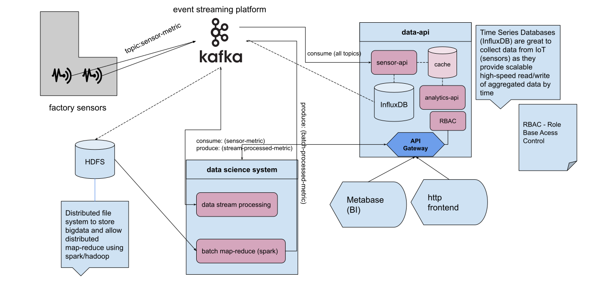

# FPSO system api

Application desgined to serve a FPSO HTTP REST api

## Dependencies

* [FastAPI](https://fastapi.tiangolo.com/): fast (high-performance), web framework for building APIs with Python 3.6+ based on standard Python type hints
* [Uvicorn](https://www.uvicorn.org/): ASGI web server implementation for Python.
* [Traefik](https://doc.traefik.io/traefik/): Traefik is an open-source Edge Router, used as a reverse-proxy
* [Docker](https://docs.docker.com/): Container Daemon

### Dev Dependencies (Optional)

* [Nix](https://nixos.org/download.html): Package Manager, creates reproducible enviroments
* [direnv](https://direnv.net/): env variables manager / loader

## Building

Using containers is prefered as it defines a standarized environment, so its much more likely that the following steps would work for everyone

### Build image

```bash
docker compose build
```

## Run

##
```bash
docker compose up
```

You also need to run database migrations:

```bash
docker compose run backend alembic upgrade head
```

Service will be running behind Traefik and can be acessible via localhost:8088

Check the OpenAPI documentation acessing `localhost:8088/redoc` or `localhost:8088/docs`

## Testing

You can run tests executing:

```bash
docker compose run backend pytest -vv --cov=app --cov-report=term-missing app
```


## Components

Application is developed using Python, as it is a friendly high-level general purpose language. HTTP Rest uses FastAPI, an high-perfomant ASGI compatible framework, that supports async requests and has great integration with OpenAPI and standarization, furthermore FastAPI, similar to Flask is lightweight and with fewer boilerplate code compared to other frameworks. Finally, the web server is run using Uvicorn, an implementation of [ASGI](https://asgi.readthedocs.io/en/latest/) supporting async request, websockets and much more.

Database of choice is the Relational (SQL) [PostgreSQL](https://www.postgresql.org/) chosen as it is open-souce and a industry standard with over 30 years of active development.

Traefik is the chosen reverse-proxy, acting as the gateway to the backend and dealing with routing, load balancing. Traefik was chosen as it has dynamic service discovery and good integration with Docker, specially docker-compose


## PART2 - Architecturea

Design the architecture of system to present data of sensor in industry factories and also present the result of data science analysis of this data.
This system should present the data in your own frontend and in a BI system and be consumed through an API.
It should be scalable for a high volume of users. You need to be authenticated to access it.
The system receives data from a data science system and a sensor gathering platform, you should decide how this data is received.


Assignment [PART 2](https://docs.google.com/drawings/d/1XFMLhY9DghglmFCSDRGmoQk8F6K_BayHDrNWyC-ROQg/edit?usp=sharing)

> Link above has comments and zoom interaction





#### Event Streaming
Kafka is a industry standard event streaming platform, is has great reliability and scalability. Here we also use kafka as a "message queue".

To persist data we also have two sink connectors: HDFS and InfluxDB

HDFS has horizontal scaling and will be used mainly for big data processing by the data science system

InfluxDB will persist all sensor data in a time-series fashion, it would provide our api low latency aggregated data


#### Data Science system

The data science system will be able to perform data stream processing connecting to Kafka directly

Also, big data map-reduce is enabled by using spark+hdfs to scale as needed

#### Data APIs

data-api will interact with Kafka and InfluxDB to provide an API to be used with our interfaces (BI, Frontend)

there are services sensor-api and analytics-api

sensor-api: collects data related to sensor-metrics, basically data aggregation and read sensor data

analytics-api: contains data acquired from data engineering such as batch analytics and streaming
